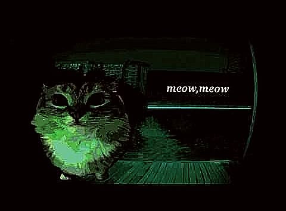

<div align="center">



<br><br>

# 👋 Hi, I'm **Morugogo!**

### 💻 Developer · IT · Networking

**Building things, solving problems and constantly learning.**

<br>

<a href="https://github.com/Morugogo">

</a>
&nbsp;
<a href="#">

</a>
&nbsp;
<a href="mailto:">

</a>
&nbsp;
<a href="#">

</a>

</div>

<br>

---

<div align="center">

## 🚀 About Me

</div>

<table>
<tr>

<td width="60%" valign="top">

### Hey there! 👋

I'm **Morugogo**, an IT enthusiast interested in software development, networking and technology.

I enjoy understanding how things work, solving technical problems and experimenting with new tools.

Currently I'm focusing on improving my programming and computer science fundamentals while building projects and expanding my technical knowledge.

### 💡 Currently

* 🐍 Learning **Python**
* 🎓 Studying **CS50x**
* 🌐 Exploring **Web Development**
* 📡 Learning **Cisco Networking**
* 🐧 Working with **Linux**
* 🔧 Building personal projects
* 🧠 Improving my problem-solving skills

### 🎯 Interests

`Software Development` · `IT` · `Networking` · `Automation` · `Linux` · `Web`

</td>

<td width="40%" align="center">


</td>

</tr>
</table>

---

<div align="center">

## 🤝 Connect

<br>

<a href="https://github.com/Morugogo">

</a>
&nbsp;&nbsp;&nbsp;
<a href="#">

</a>
&nbsp;&nbsp;&nbsp;
<a href="mailto:">

</a>

</div>

<br>

---

<div align="center">

## 💻 Tech Stack

### Languages & Web


<br><br>

### Tools & Development


<br><br>

### Networking & Infrastructure


</div>

---

<div align="center">

## 📚 Currently Learning

<table>
<tr>
<td align="center" width="150">

🐍<br> <b>Python</b>

</td>

<td align="center" width="150">

🎓<br> <b>CS50x</b>

</td>

<td align="center" width="150">

🌐<br> <b>Web Development</b>

</td>

<td align="center" width="150">

📡<br> <b>Cisco</b>

</td>

<td align="center" width="150">

🐧<br> <b>Linux</b>

</td>
</tr>
</table>

</div>

---

<div align="center">

## 📊 GitHub Stats

<a href="https://github.com/Morugogo">


</a>

<a href="https://github.com/Morugogo">


</a>

</div>

---

<div align="center">

## 🔥 Contribution Streak


</div>

---

<div align="center">

## 📈 Activity Graph


</div>

---

<div align="center">

## 🚀 Projects

<a href="https://github.com/Morugogo?tab=repositories">


</a>

<br><br>

<sub>
More projects will appear here as I continue building and learning.
</sub>

</div>

---

<div align="center">

## ⚡ A little more about me

```text
╭──────────────────────────────────────────────╮
│                                              │
│   💻 Build                                   │
│   🧠 Learn                                   │
│   🔧 Experiment                              │
│   🚀 Improve                                 │
│                                              │
│              Repeat.                         │
│                                              │
╰──────────────────────────────────────────────╯
```

</div>

---

<div align="center">

### 👋 Thanks for visiting my profile!

<br>


<br><br>

**Made with curiosity & ☕ by Morugogo**

</div>
